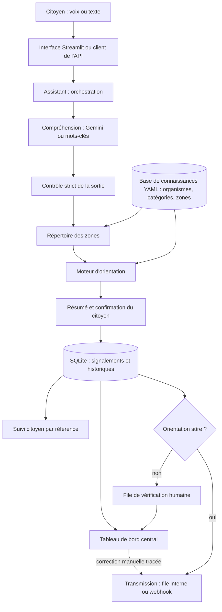

# Architecture de Yëgle

## Vue d'ensemble

## Choix techniques

| Composant | Choix | Raison |
|---|---|---|
| Compréhension | Gemini, audio en entrée | Un seul appel transcrit et extrait ; gère le mélange wolof-français |
| Orientation | Règles déterministes en Python | Explicable, testable, sans hallucination possible |
| Connaissances | Fichiers YAML | Modifiables sans code ni réentraînement, relus dans Git |
| Stockage | SQLite | Aucune installation ; remplaçable par PostgreSQL |
| Interface | Streamlit | Rapide à construire, micro intégré, utilisable sur téléphone |
| API | FastAPI | Validation des entrées, documentation automatique |

## Parcours et étapes du cahier des charges

| Étape | Où |
|---|---|
| Capture audio | `ui/Signaler.py`, `POST /api/analyze/audio` |
| Transcription, langue, extraction, classification | `app/understanding.py` |
| Localisation | `app/zones.py` |
| Recherche de l'organisme, confiance | `app/routing.py` |
| Informations manquantes, clarification | `app/assistant.py`, méthode `analyze` |
| Résumé, confirmation, création, référence | `app/assistant.py`, méthode `submit` |
| Transmission ou file d'orientation | `app/transmission.py` |
| Suivi du statut | `app/storage.py` |

## Moteur d'orientation

Entrées : catégorie, sous-catégorie, zone, confiance dans la compréhension. Pour chaque organisme actif dont une règle correspond à la catégorie :

1. S'il ne couvre pas la zone connue du signalement, il est écarté.
2. Sa confiance part de celle de la règle, puis est multipliée par :
   - 0,6 si la zone est inconnue ;
   - 0,5 si l'organisme dépend de la commune et que la commune n'est pas identifiée ;
   - 0,7 si sa fiche n'a pas de date de vérification.
3. Les candidats sont classés. Le premier est retenu.

Le signalement part en vérification humaine (`organization_to_verify`) si la confiance du premier est sous `ROUTING_MIN_CONFIDENCE` (0,75), si le deuxième est à moins de 0,10, si le problème est mal compris, ou si aucun organisme ne correspond. Chaque décision est enregistrée avec la règle appliquée, la justification et la liste des candidats.

Trois confiances sont conservées : `confidence_problem` (modèle), `confidence_location` (0,9 commune reconnue, 0,5 zone trop large, 0,3 lieu dit mais inconnu), `confidence_organization` (moteur).

## Modèle de la base de connaissances

Une fiche d'organisme dans `data/organismes.yaml` :

| Champ | Rôle |
|---|---|
| `organization_id`, `organization_name`, `organization_type` | Identité |
| `domains`, `subcategories` | Compétences |
| `territorial_coverage` | `national`, `region:<id>`, `departement:<id>` ou `zone:<id>` |
| `responsible_services` | Services internes, par sous-catégorie |
| `contact_channels`, `api_endpoint_if_available`, `transmission_mode` | Canaux |
| `routing_rules` | Règles : identifiant, catégorie, confiance |
| `escalation_rules` | Prévu pour l'escalade, pas encore exploité par le moteur |
| `active_status`, `last_verified_at`, `source_url` | État et preuve de vérification |
| `per_commune` | Une fiche pour toutes les mairies, nommée d'après la commune |

## Modèle de données

- `reports` : référence, dates, statut, catégorie, description, transcription, lieu dit, zone, coordonnées GPS si fournies, urgence, langue, source, trois confiances, organisme, statut d'orientation.
- `routing_decisions` : une ligne par décision, automatique ou manuelle, avec auteur, règle, justification et candidats.
- `status_history` : chaque changement de statut, avec auteur et note.
- `transmissions` : date, canal, destinataire, résultat, erreur.

Statuts : `RECEIVED → ROUTED → ASSIGNED → IN_PROGRESS → RESOLVED → CLOSED`, avec `NEEDS_REVIEW` et `REJECTED`. Les passages autorisés sont définis dans `TRANSITIONS` (`app/storage.py`).

## API

| Méthode | Chemin | Rôle |
|---|---|---|
| GET | `/health` | État et erreurs de configuration |
| GET | `/api/categories` | Catégories reconnues |
| POST | `/api/analyze` | Message écrit : question ou résumé à confirmer |
| POST | `/api/analyze/audio` | Message vocal |
| POST | `/api/reports` | Enregistre le signalement confirmé |
| GET | `/api/reports/{reference}` | Suivi citoyen |
| GET | `/api/admin/reports` | Liste filtrée |
| GET | `/api/admin/reports/{reference}` | Détail et historiques |
| PATCH | `/api/admin/reports/{reference}/status` | Changer le statut |
| POST | `/api/admin/reports/{reference}/reroute` | Réorienter, motif obligatoire |
| GET | `/api/admin/organizations`, `/api/admin/stats` | Organismes, compteurs |

Les chemins `/api/admin` exigent l'en-tête `X-API-Key`.

Le brouillon vit côté client entre deux messages. Chaque réponse de `/api/analyze` le renvoie avec une signature `draft_token` (HMAC-SHA256, secret `DRAFT_SECRET`). Le client renvoie `draft` et `draft_token` sans les modifier au message suivant et à `/api/reports` ; un brouillon modifié, incomplet ou sans signature est refusé (422). Le client ne peut donc pas s'attribuer une catégorie, une description, un lieu ou une confiance.

Limites de débit par adresse IP (fenêtre glissante, `app/ratelimit.py`) : 20 analyses par minute, écrit et vocal confondus, y compris dans l'interface ; 10 signalements par heure ; 60 consultations du suivi par minute ; 5 échecs de connexion au tableau de bord par quart d'heure. Au-delà, l'API répond 429 avec l'en-tête `Retry-After`. Les compteurs sont en mémoire, propres à chaque processus. Derrière un proxy, lancer uvicorn avec `--proxy-headers --forwarded-allow-ips` pour compter l'adresse du citoyen et non celle du proxy.

## Cas d'erreur

| Cas | Comportement |
|---|---|
| Micro refusé | Le champ de saisie écrite reste disponible |
| Audio inaudible | L'assistant demande de répéter ou d'écrire |
| Réponse du modèle illisible ou hors liste | Valeurs rejetées, question de clarification |
| Message hors sujet | Rappel de ce que fait le service |
| Lieu absent | Une question, une seule fois |
| Lieu trop large ou inconnu | Une demande de précision, puis vérification humaine |
| Organisme introuvable, plusieurs possibles, confiance faible | Vérification humaine, aucun nom annoncé |
| Modèle indisponible ou quota atteint | Modèle de secours, puis OpenAI, puis mots-clés pour l'écrit |
| Webhook en échec | Tentative enregistrée, retour en vérification humaine |
| Annulation | Rien n'est enregistré |

## Sécurité

Sorties du modèle contrôlées champ par champ. Brouillon de l'API validé et signé par le serveur. Débit limité par adresse IP, connexion au tableau de bord bloquée après plusieurs échecs. Orientation recalculée par le serveur. Destinations issues de la seule base de connaissances, webhooks en https uniquement. Administration fermée tant qu'aucun secret n'est configuré. Audio non conservé, aucune donnée d'identité collectée. Toutes les décisions et corrections sont tracées.

## Évolution vers la production

1. Comptes par organisme, chacun ne voyant que sa file.
2. Position GPS avec consentement dans l'interface.
3. Répertoire des zones étendu à tout le pays, à partir de données ouvertes.
4. Interface d'administration de la base de connaissances, avec historique des vérifications.
5. Connecteurs vers les systèmes des organismes, notifications au citoyen.
6. PostgreSQL, file de tâches pour les transmissions, supervision.
7. Publication des signalements anonymisés en données ouvertes.
8. Évaluation de modèles vocaux wolof open-weight en remplacement de l'API.
